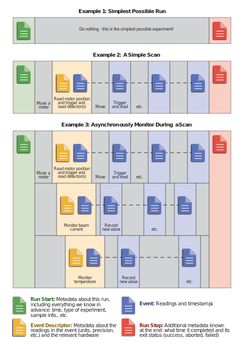

.. _data_model:

**********
Data Model
**********

A primary design goal of bluesky is to enable better research by recording
rich metadata alongside measured data for use in later analysis. Documents are
how we do this.

A *document* is our term for a Python dictionary with a schema. The bluesky
RunEngine emits documents during plan execution.  All of the metadata and data
generated by executing the plan is organized into documents. Bluesky's document-based
data model supports complex, asynchronous data collection and enables sophisticated
live, prompt, streaming, and *post-facto* data analysis.

The `bluesky documentation <https://blueskyproject.io/bluesky/>`_ describes
how outside functions can "subscribe" to a stream of these documents,
visualizing, processing, or saving them. This section provides an outline of
documents themselves, aiming to give a sense of the structure and familiarity
with useful components.

Overview
========

The data model is composed of eight types of Documents, which in Python are
represented as dictionaries but could be represented as nested mappings (e.g.
JSON) in any language. Each document class has a defined, but flexible, schema.

* Run Start Document --- Everything we know about an experiment or simulation
  before any data acquisition begins: the who / why / what and metadata such as
  sample information.
* Event --- A "row" of measurements with associated timestamps.
* Event Descriptor --- Metadata about a series of Events. Envision
  richly-detail column headings in a table, encompassing physical units,
  hardware configuration information, etc.
* Resource --- A pointer to an external file (or resource in general) that has
  predictable and fixed dimensionality.
* Datum --- A pointer to a specific slice of data within a Resource.
* Stream Resource (Experimental) --- A pointer to an external resource that contains a stream
  of data without restriction on the length of the stream. This resources with
  know 'column' dimension without a known number of rows (e.g., time series, point detectors).
* Stream Datum (Experimental) --- A pointer to a specific slice of data within a Stream Resource.
* Run Stop Document ---  Everything that we can only know at the very end, such
  as the time it ended and the exit status (succeeded, aborted, failed due to
  error).

Every document contains a unique identifier. The Event documents also have
a ``descriptor`` field linking them to the Event Descriptor with their metadata.
And the Event Descriptor and Run Stop documents have a ``run_start`` field linking
them to their Run Start. Thus, all the documents in a run are linked back to the
Run Start.

Event documents may contain the literal values or *pointers* to values that
are stored in some external file or networked resource, yet to be loaded. The
Resource and Datum document types manage references to externally-stored data.

Example Runs
============

Finally, Event and Datum can be represented in "paged" form, where multiple
rows are contained in one structure for efficient transport and vectorized
computation. The representations contain equivalent information: an EventPage
can always be transformed, without loss, into an Event and vice versa.

The scope of a "run" is left to the instrument team or individual scientist. It is
quite generic: a set of Documents generated by following a given sequence of
instructions. This might encompass a single short measurement (say, "a count")
or a multi-step procedure such as a raster scan. A run should represent a set
of individual measurements that will be collected or processed together.

Document Types in Detail
========================

For each type, we will show:

* the minimal nontrivial example that satisfies the schema
* one or more "typical" examples generated by bluesky's RunEngine during an
  experiment
* the formal schema, encoded using
  `JSON schema <https://json-schema.org/understanding-json-schema/>`_

.. toctree::
   :maxdepth: 1

   event-descriptors

.. _start:

Run Start Document
------------------

Again, a 'run start' document marks the beginning of the run. It comprises
everything we know before we start taking data, including all metadata provided
by the user and the plan.

Minimal nontrivial valid example:

..

   Documentation note: It might seem more natural to use json code-blocks here
   than python ones, but using python allows us to include comments in line.

.. code-block:: python

   # 'run start' document
   {'time': 1550069716.5092213,  # UNIX epoch (seconds since 1 Jan 1970)
    'uid': '10bf6945-4afd-43ca-af36-6ad8f3540bcd'}  # globally unique ID

A typical example

.. code-block:: python

   # 'run start' document
   {'data_session': 'vist54321',
    'data_groups': ['bl42', 'proposal12345'],
    'detectors': ['random_walk:x'],
    'hints': {'dimensions': [(['random_walk:dt'], 'primary')]},
    'motors': ('random_walk:dt',),
    'num_intervals': 2,
    'num_points': 3,
    'plan_args': {'args': ["EpicsSignal(read_pv='random_walk:dt', " "name='random_walk:dt', " 'value=1.0, ' 'timestamp=1550070001.828528, ' 'auto_monitor=False, ' 'string=False, ' "write_pv='random_walk:dt', " 'limits=False, ' 'put_complete=False)', -1, 1],
                  'detectors': ["EpicsSignal(read_pv='random_walk:x', " "name='random_walk:x', " 'value=1.61472277847348, ' 'timestamp=1550070000.807677, ' 'auto_monitor=False, ' 'string=False, ' "write_pv='random_walk:x', " 'limits=False, ' 'put_complete=False)'],
                  'num': 3,
                  'per_step': 'None'},
    'plan_name': 'scan',
    'plan_pattern': 'inner_product',
    'plan_pattern_args': {'args': ["EpicsSignal(read_pv='random_walk:dt', " "name='random_walk:dt', " 'value=1.0, ' 'timestamp=1550070001.828528, ' 'auto_monitor=False, ' 'string=False, ' "write_pv='random_walk:dt', " 'limits=False, ' 'put_complete=False)', -1, 1],
                          'num': 3},
    'plan_pattern_module': 'bluesky.plan_patterns',
    'plan_type': 'generator',
    'scan_id': 2,
    'time': 1550070004.9850419,
    'uid': 'ba1f9076-7925-4af8-916e-0e1eaa1b3c47'}

.. note::

    Time is given in UNIX time (seconds since 1970). Software for looking at
    the data would, of course, translate that into a more human-readable form.

.. _projections:

Projections (Experimental)
^^^^^^^^^^^^^^^^^^^^^^^^^^

The Run Start document may include a ``projections`` field. It is intended
that a projection is an aid to interacting with external systems using
standardized vocabularies. Projections might be used in a variety of use cases
such as providing run data to analysis tools or suitcases. Each projection
represents multiple ways to represent data from the run. Each field in the
projection dictionary is an unique and externally-identifiable string and each
value is an instruction for accessing data from the run. This feature is
experimetal and subject to backward-incompatible changes in future releases.

The run start document formal schema:

.. literalinclude:: ../../src/event_model/schemas/run_start.json

.. _descriptor:

Event Descriptor
----------------

As stated above, an 'event descriptor' document provides a schema for the data
in the Event documents. It provides useful information about each key in the
data and about the configuration of the hardware. The layout of a descriptor
is detailed and takes some time to cover, so we defer it to a
:doc:`another page <event-descriptors>`.

Minimal nontrivial valid example:

.. code-block:: python

   # 'event descriptor' document
   {'configuration': {},
    'data_keys': {'camera_image': {'dtype': 'number',
                                   'shape': [512, 512],
                                   'source': 'PV:...'}},
    'hints': {},
    'name': 'primary',
    'object_keys': {},
    'run_start': '10bf6945-4afd-43ca-af36-6ad8f3540bcd',  # foreign key
    'time': 1550070954.276659,
    'uid': 'd08d2ada-5f4e-495b-8e73-ff36186e7183'}

Typical example:

.. code-block:: python

   # 'event descriptor' document
   {'configuration': {'random_walk:dt': {'data': {'random_walk:dt': -1.0},
                                         'data_keys': {'random_walk:dt': {'dtype': 'number',
                                                                          'lower_ctrl_limit': 0.0,
                                                                          'precision': 0,
                                                                          'shape': [],
                                                                          'source': 'PV:random_walk:dt',
                                                                          'units': '',
                                                                          'upper_ctrl_limit': 0.0}},
                                         'timestamps': {'random_walk:dt': 1550070004.994477}},
                      'random_walk:x': {'data': {'random_walk:x': 1.9221013521832928},
                                        'data_keys': {'random_walk:x': {'dtype': 'number',
                                                                        'lower_ctrl_limit': 0.0,
                                                                        'precision': 0,
                                                                        'shape': [],
                                                                        'source': 'PV:random_walk:x',
                                                                        'units': '',
                                                                        'upper_ctrl_limit': 0.0}},
                                        'timestamps': {'random_walk:x': 1550070004.812525}}},
    'data_keys': {'random_walk:dt': {'dtype': 'number',
                                     'lower_ctrl_limit': 0.0,
                                     'object_name': 'random_walk:dt',
                                     'precision': 0,
                                     'shape': [],
                                     'source': 'PV:random_walk:dt',
                                     'units': '',
                                     'upper_ctrl_limit': 0.0},
                  'random_walk:x': {'dtype': 'number',
                                    'lower_ctrl_limit': 0.0,
                                    'object_name': 'random_walk:x',
                                    'precision': 0,
                                    'shape': [],
                                    'source': 'PV:random_walk:x',
                                    'units': '',
                                    'upper_ctrl_limit': 0.0}},
    'hints': {'random_walk:dt': {'fields': ['random_walk:dt']},
              'random_walk:x': {'fields': ['random_walk:x']}},
    'name': 'primary',
    'object_keys': {'random_walk:dt': ['random_walk:dt'],
                    'random_walk:x': ['random_walk:x']},
    'run_start': 'ba1f9076-7925-4af8-916e-0e1eaa1b3c47',
    'time': 1550070005.0109222,
    'uid': '0ad55d9e-1b31-4af2-865c-7ab7c8171303'}

Formal schema:

.. literalinclude:: ../../src/event_model/schemas/event_descriptor.json

.. _event:

Event Document
--------------

The Event document may contain data directly:

.. code-block:: python

   # 'event' document
   {'data': {'camera_image': [[...512x512 array...]]},
    'descriptor': 'd08d2ada-5f4e-495b-8e73-ff36186e7183',  # foreign key
    'filled': {},
    'seq_num': 1,
    'time': 1550072091.2793343,
    'timestamps': {'camera_image': 1550072091.2793014},
    'uid': '8eac2f83-2b3e-4d67-ae2c-1d3aaff29ff5'}

or it may reference it via a ``datum_id`` from a Datum document.

.. code-block:: python

   # 'event' document
   {'data': {'camera_image': '272132cf-564f-428f-bf6b-149ee4287024/1'},  # foreign key
    'descriptor': 'd08d2ada-5f4e-495b-8e73-ff36186e7183',  # foreign key
    'filled': {'camera_image': False},
    'seq_num': 1,
    'time': 1550072091.2793343,
    'timestamps': {'camera_image': 1550072091.2793014},
    'uid': '8eac2f83-2b3e-4d67-ae2c-1d3aaff29ff5'}

See :doc:`external` for details on how external assets are handled.

Typical example:

.. code-block:: python

   # 'event' document
   {'data': {'random_walk:dt': -1.0,
             'random_walk:x': 1.9221013521832928},
    'descriptor': '0ad55d9e-1b31-4af2-865c-7ab7c8171303',
    'filled': {},
    'seq_num': 1,
    'time': 1550070005.0189056,
    'timestamps': {'random_walk:dt': 1550070004.994477,
                   'random_walk:x': 1550070004.812525},
    'uid': '7b5343fe-dfd7-4884-bc18-a0b571ff60b7'}

From a data analysis perspective, these readings were simultaneous, but in
actuality the occurred at separate times.  The separate times of the individual
readings are not thrown away (they are recorded in 'timestamps') but the
overall event 'time' is often more useful.

Formal schema:

.. literalinclude:: ../../src/event_model/schemas/event.json

.. _event_page:

Event Page
----------

Event contents can also be represented in "paged" form, where multiple
rows are contained in one structure for efficient transport and vectorized
computation. The representations contain equivalent information: an EventPage
can always be transformed, without loss, into an Event and vice versa. Here is
the example Event above structured as an Event Page with a single row:

.. code-block:: python

   # 'event_page' document
   {'data': {'random_walk:dt': [-1.0],
             'random_walk:x': [1.9221013521832928]},
    'descriptor': '0ad55d9e-1b31-4af2-865c-7ab7c8171303',
    'filled': {},
    'seq_num': [1],
    'time': [1550070005.0189056],
    'timestamps': {'random_walk:dt': [1550070004.994477],
                   'random_walk:x': [1550070004.812525]},
    'uid': ['7b5343fe-dfd7-4884-bc18-a0b571ff60b7']}

Formal Event Page schema:

.. literalinclude:: ../../src/event_model/schemas/event_page.json

It is intentional that the values in the "data" and "timestamps" dictionaries
do not have structure. The values may be numeric, bool, null (``None``), or a
homogeneous N-dimensional array of any of these. The values are never objects
or dictionaries (to use the JSON and Python terminology respectively). This
requirement allows document-consumers to make useful simplifying assumptions.
As another justification for this design, consider that if we allowed one level
of nesting in "data", then it could lead to wanting *those* values to
allow nesting and so on, which would lead us to accepting arbitrarily nested
structured data. This in turn would makes the Event Descriptors significantly
more complex. Thus, we require that the values in "data" never be structured.

.. _stop:

Run Stop Document
-----------------

A 'run stop' document marks the end of the run. It contains metadata that is not
known until the run completes.

The most commonly useful fields here are 'time' and 'exit_status'.

Minimal nontrivial valid example:

.. code-block:: python

   # 'run stop' document
   {'uid': '546cc556-5f69-46b5-bf36-587d8cfe67a9',
    'time': 1550072737.175858,
    'run_start': '61bb1db8-c95c-4144-845b-e248c06d80e1',
    'exit_status': 'success',
    'reason': '',
    'num_events': {}}

Typical example:

.. code-block:: python

   # 'stop' document
   {'run_start': 'ba1f9076-7925-4af8-916e-0e1eaa1b3c47',
    'time': 1580172029.3419003,
    'uid': '78c70c2c-2508-479e-9857-05553748022e',
    'exit_status': 'success',
    'reason': '',
    'num_events': {'primary': 10}

Formal schema:

.. literalinclude:: ../../src/event_model/schemas/run_stop.json

.. _resource:

Resource Document
-----------------

See :doc:`external` for details on the role Resource documents play in
referencing external assets, such as large array data written by detectors.

Minimal nontrivial valid example:

.. code-block:: python

   # 'resource' document
   {'path_semantics': 'posix',
    'resource_kwargs': {},
    'resource_path': '/local/path/subdirectory/data_file',
    'root': '/local/path/',
    'run_start': '10bf6945-4afd-43ca-af36-6ad8f3540bcd',
    'spec': 'SOME_SPEC',
    'uid': '272132cf-564f-428f-bf6b-149ee4287024'}

Typical example:

.. code-block:: python

   # resource
   {'spec': 'AD_HDF5',
    'root': '/GPFS/DATA/Andor/',
    'resource_path': '2020/01/03/8ff08ff9-a2bf-48c3-8ff3-dcac0f309d7d.h5',
    'resource_kwargs': {'frame_per_point': 10},
    'path_semantics': 'posix',
    'uid': '3b300e6f-b431-4750-a635-5630d15c81a8',
    'run_start': '10bf6945-4afd-43ca-af36-6ad8f3540bcd'}

Formal schema:

.. literalinclude:: ../../src/event_model/schemas/resource.json

.. _datum:

Datum Document
--------------

See :doc:`external` for details on the role Datum documents play in referencing
external assets, such as large array data written by detectors.

Minimal nontrivial valid example:

.. code-block:: python

   # 'datum' document
   {'resource': '272132cf-564f-428f-bf6b-149ee4287024',  # foreign key
    'datum_kwargs': {},  # format-specific parameters
    'datum_id': '272132cf-564f-428f-bf6b-149ee4287024/1'}

Typical example:

.. code-block:: python

   # datum
   {'resource': '3b300e6f-b431-4750-a635-5630d15c81a8',
    'datum_kwargs': {'index': 0},
    'datum_id': '3b300e6f-b431-4750-a635-5630d15c81a8/0'}

It is an implementation detail that ``datum_id`` is often formatted as
``{resource}/{counter}`` but this should not be considered part of the schema.

Formal schema:

.. literalinclude:: ../../src/event_model/schemas/datum.json

.. _datum_page:

Datum Page
----------

Like Events, Datum contents can also be represented in "paged" form, and the
representations contain equivalent information. This is the Datum example above
strucuted as a Datum Page with one row:

.. code-block:: python

   # datum
   {'resource': '3b300e6f-b431-4750-a635-5630d15c81a8',
   'datum_kwargs': {'index': [0]},
   'datum_id': ['3b300e6f-b431-4750-a635-5630d15c81a8/0']}

Formal Datum Page schema:

.. literalinclude:: ../../src/event_model/schemas/datum_page.json

.. _stream_resource:

Stream Resource Document (Experimental)
---------------------------------------

See :doc:`external` for details on the role Stream Resource documents play in
referencing external assets that are natively ragged, such as single-photon detectors,
or assets where there are many relatively small data sets (e.g. scanned fluorescence data).

Typical example:

.. code-block:: python

   # 'Stream Resource' document
   {'data_key': 'detector_1',
    'mimetype': 'application/x-hdf5',
    'uri': 'file://localhost/GPFS/DATA/Andor/01/03/8ff08ff9-a2bf-48c3-8ff3-dcac0f309d7d.h5',
    'parameters': {'frame_per_point': 1},
    'uid': '3b300e6f-b431-4750-a635-5630d15c81a8',
    'run_start': '10bf6945-4afd-43ca-af36-6ad8f3540bcd'}

Formal schema:

.. literalinclude:: ../../src/event_model/schemas/stream_resource.json

.. _stream_datum:

Stream Datum Document
---------------------

See :doc:`external` for details on the role Stream Datum documents play in referencing
external assets that are natively ragged, such as single-photon detectors,
or assets where there are many relatively small data sets (e.g. scanned fluorescence data).

Typical example:

.. code-block:: python

   # 'Stream Datum' document
   {'uid': '86340942-9865-47f9-9a8d-bdaaab1bfce2',
    'descriptor': '8c70b8c2-df32-40e3-9f50-29cda8142fa0',
    'stream_resource': '272132cf-564f-428f-bf6b-149ee4287024',  # foreign key
    'indices': {'start': 0, 'stop': 1},
    'seq_nums': {'start': 1, 'stop': 2},
    }

Formal schema:

.. literalinclude:: ../../src/event_model/schemas/stream_datum.json

.. _bulk_events:

"Bulk Events" Document (DEPRECATED)
-----------------------------------

This is another representation of Events. This representation is deprecated.
Use EventPage instead.

.. literalinclude:: ../../src/event_model/schemas/bulk_events.json

.. _bulk_datum:

"Bulk Datum" Document (DEPRECATED)
----------------------------------

This is another representation of Datum. This representation is deprecated. Use
DatumPage instead.

.. literalinclude:: ../../src/event_model/schemas/bulk_datum.json
